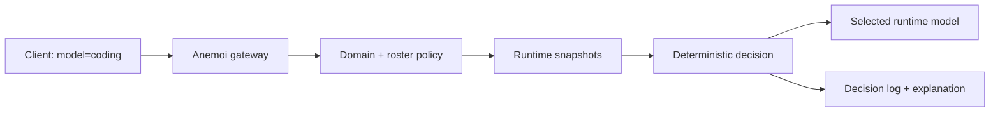

# Anemoi

[](https://github.com/Loose-Arrow-Labs/anemoi/actions/workflows/ci.yml)
[](https://github.com/Loose-Arrow-Labs/anemoi/actions/workflows/release.yml)

**Status**: Beta. CI is active and tagged release artifacts are prepared through
the release workflow; live runtime, Docker/DNS, and dashboard readiness are
tracked in [Known Limitations](docs/LIMITATIONS.md).

Anemoi is a local-first inference governance layer that chooses the best
available runtime model, explains why, and records every decision.

```text
Anemoi decides.
Runtimes execute.
```

Anemoi sits in front of local runtimes such as llama-swap, Ollama, and
llama.cpp. Clients send a governance domain like `coding`; Anemoi inspects
runtime state, scores eligible candidates, chooses a model/runtime path, and
returns headers and records that explain the decision.

## Dashboard

A read-only operator view of every decision — what was selected, why, and what was
rejected or staged instead:


The daemon serves this Vite/TypeScript dashboard at `/dashboard/` from read-only
telemetry endpoints. See [docs/DASHBOARD.md](docs/DASHBOARD.md) to run it, and
[reproduce this screenshot](docs/DASHBOARD.md#reproduce-this-screenshot) from
fixture data (no live runtime required).

## Quickstart

This path uses the Rust daemon and the checked-in mock config. It does not
require a live model server.

Terminal 1:

```powershell
cargo run -p anemoi-daemon
```

Terminal 2:

```powershell
curl.exe http://127.0.0.1:7070/health
curl.exe http://127.0.0.1:7070/v1/models
```

Send one OpenAI-compatible request through Anemoi and include response headers:

```powershell
curl.exe -i -X POST http://127.0.0.1:7070/v1/chat/completions `
  -H "Content-Type: application/json" `
  -d '{""model"":""coding"",""messages"":[{""role"":""user"",""content"":""what is 2+2?""}],""max_tokens"":32}'
```

Then inspect why the decision happened:

```powershell
$decisionId = "<copy X-Anemoi-Decision-Id from the response headers>"
curl.exe "http://127.0.0.1:7070/explain/$decisionId"
```

What to look for:

- `X-Anemoi-Decision-Id`: stable id for the recorded decision.
- `X-Anemoi-Selected-Model`: the runtime model Anemoi selected.
- `X-Anemoi-Action`: what Anemoi chose to do.
- `/explain/:id`: structured reasons and rejected options.

With the default config, the request domain is `coding`, the runtime adapter is
`mock`, and the selected model comes from `config/anemoi.example.yaml`.

## What Anemoi Does

Anemoi answers:

```text
What should execute?
Where should it execute?
Should execution happen now?
What resources should remain resident?
What is the cheapest acceptable path?
Why was that decision made?
```

The scheduling target is:

```text
request -> domain -> roster -> residency group -> profile -> runtime
```

Not:

```text
request -> model
```

## What Anemoi Is Not

Anemoi is not an inference runtime, model host, provider gateway, agent
framework, memory system, RAG system, vector database, or training system.

Runtimes execute model work. Anemoi governs which path should be used and why.

## Request Flow



## API Surface

| Endpoint | Purpose |
|---|---|
| `GET /health` | Basic daemon health. |
| `GET /status` | Operator summary of runtimes, residents, staging, warnings, and policy state. |
| `GET /residents` | Normalized runtime residency snapshots. |
| `POST /decide` | Return a scheduling decision without executing inference. |
| `POST /execute` | Decide and return an explicit action-plan handoff. |
| `GET /staging` | List background staging intents and skip reasons. |
| `GET /decisions/:id` | Fetch a recorded decision. |
| `GET /explain/:id` | Fetch the explanation for a recorded decision. |
| `GET /v1/models` | OpenAI-compatible list of governance domains. |
| `POST /v1/chat/completions` | OpenAI-compatible gateway request governed by Anemoi. |
| `GET /openapi.json` | OpenAPI document for the daemon API. |

The read-only dashboard at `/dashboard/` and its telemetry JSON endpoints are
documented in [docs/DASHBOARD.md](docs/DASHBOARD.md).

## Operator Commands

```powershell
cargo run -p anemoi-cli -- status
cargo run -p anemoi-cli -- residents
cargo run -p anemoi-cli -- decide --domain coding --latency-budget-ms 1500
cargo run -p anemoi-cli -- explain <decision-id>
```

Use the daemon endpoints for HTTP smoke checks:

```powershell
curl.exe http://127.0.0.1:7070/status
curl.exe http://127.0.0.1:7070/residents
curl.exe http://127.0.0.1:7070/staging
```

## Configuration

Default local config:

```text
config/anemoi.example.yaml
```

That config defines:

- domain `coding`
- mock runtime `mock`
- resident model `qwen9b`
- larger candidate `qwen35_a3b`
- continuity settings for hot-worker reuse and background staging

Live runtime examples live under `config/`, including the llama-swap oriented
`config/anemoi.prometheus.yaml`.

## Crates

| Crate | Responsibility |
|---|---|
| `anemoi-core` | Domain types, config, residency states, decisions, explanations. |
| `anemoi-runtime` | Runtime adapter trait and inspection adapters. |
| `anemoi-policy` | Deterministic scheduling, scoring, continuity, eviction, and transition policy. |
| `anemoi-telemetry` | Decision logs and event telemetry. |
| `anemoi-daemon` | Axum local control-plane API and OpenAI-compatible gateway. |
| `anemoi-cli` | Operator commands. |
| `anemoi-mcp` | Minimal MCP control-plane adapter. |

## Current Limitations

Anemoi is in local-first beta shape. The mock quickstart is the reliable default
demo. Live llama-swap, Ollama, and llama.cpp integrations should be validated in
your environment before advertising them as operational.

Important limits:

- Anemoi does not host or download models.
- Live runtime mutation requires explicit execution paths and safety gates.
- Provider-gateway behavior is not the core v1 goal.

[docs/LIMITATIONS.md](docs/LIMITATIONS.md) centralizes the live-runtime,
Docker/DNS, dashboard, MCP, and security caveats and their readiness status.

## Deeper Docs

- [Getting Started](docs/GETTING_STARTED.md)
- [Inference Gateway](docs/INFERENCE_GATEWAY.md)
- [Dashboard](docs/DASHBOARD.md)
- [Deployment](docs/DEPLOYMENT.md)
- [Release](docs/RELEASE.md)
- [Known Limitations](docs/LIMITATIONS.md)
- [Live Validation](docs/live_validation/README.md)
- [Test Roadmap](docs/test_roadmap.md)
- [Contributing](CONTRIBUTING.md)

## Development Checks

```powershell
cargo fmt --check
cargo test --workspace
cargo clippy --workspace --all-targets -- -D warnings
cargo run -p anemoi-guard -- crates
```
